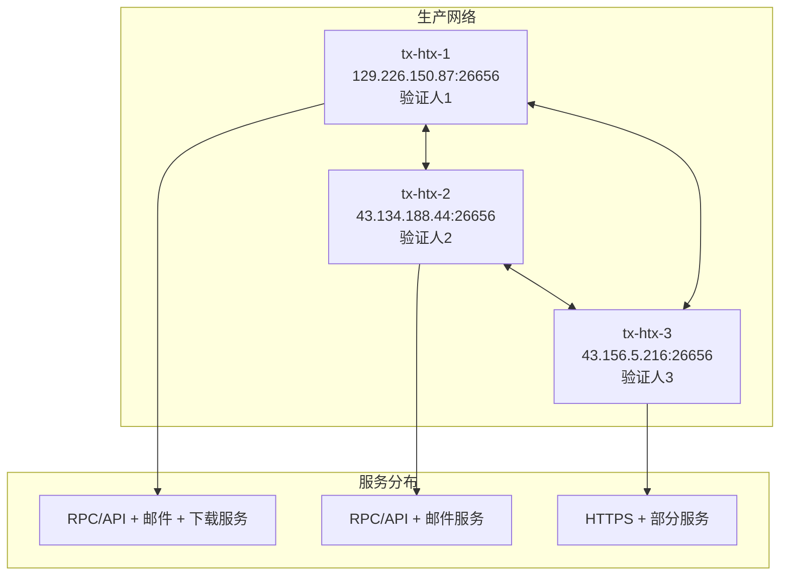

# MailChat Chain 部署指南

## 📋 目录

1. [生产网络架构](#生产网络架构)
2. [快速部署](#快速部署)
3. [节点配置](#节点配置)
4. [验证人部署](#验证人部署)
5. [服务管理](#服务管理)
6. [监控与维护](#监控与维护)
7. [故障恢复](#故障恢复)
8. [安全最佳实践](#安全最佳实践)

---

## 生产网络架构

### 当前网络状态

MailChat Chain 当前运行在3节点验证人网络上：

| 服务器 | 主机名 | 公网IP | 验证人地址 | 角色 | 主要服务 |
|--------|--------|--------|------------|------|----------|
| **tx-htx-1** | VM-16-13-debian | 129.226.150.87 | F8A114035A833756CE0CE92193DED4380BD545CA | 主验证人 + 服务节点 | 区块链、邮件、Nginx、RPC/API |
| **tx-htx-2** | VM-16-4-debian | 43.134.188.44 | 370C1E79C75C7CCC6770EFCAD4E3AFA28A7A4E4B | 验证人节点 | 区块链、邮件、RPC/API |
| **tx-htx-3** | VM-0-10-debian | 43.156.5.216 | 0004921274C361C06436F14EE788B7DC62D6D8C4 | 验证人节点 | 区块链、Web服务 |

### 网络参数

```yaml
网络配置:
  Chain ID: mailchatd_26000
  Network ID: 26000
  EVM Chain ID: 26000
  共识: Tendermint BFT
  验证人数量: 3
  投票权分配: 平均 (每个1000)
  出块时间: 3-5秒
  当前区块高度: ~96,700+
  
代币经济:
  原生代币: MCC (Mail Chat Coin)
  基础单位: amcc
  精度: 18位小数 (1 MCC = 10^18 amcc)
  总供应量: 可配置
```

### P2P网络拓扑



### 服务端口映射

| 服务器 | 26656 (P2P) | 26657 (RPC) | 8545 (EVM) | 8825 (SMTP) | 993 (IMAP) | 587 (Submit) | 80/443 |
|--------|-------------|-------------|------------|-------------|------------|--------------|--------|
| tx-htx-1 | ✅ | ✅ | ✅ | ✅ | ✅ | ✅ | ✅ |
| tx-htx-2 | ✅ | ✅ | ✅ | ✅ | ✅ | ✅ | ✅ |
| tx-htx-3 | ✅ | ✅ | ❌ | ❌ | ❌ | ✅ | ✅ |

---

## 快速部署

### 一键部署脚本

使用自动化脚本快速部署新节点：

```bash
# 下载并执行部署脚本
curl -sSL https://raw.githubusercontent.com/mail-chat-chain/mailchatd/main/start.sh | bash

# 或者下载后执行
wget https://raw.githubusercontent.com/mail-chat-chain/mailchatd/main/start.sh
chmod +x start.sh
./start.sh
```

脚本将自动：
1. 检测系统架构并下载正确的二进制文件
2. 初始化节点配置
3. 配置DNS和TLS证书（支持15种DNS提供商）
4. 设置P2P网络连接
5. 创建并启动systemd服务

### 手动部署步骤

#### 1. 系统准备

```bash
# 更新系统
sudo apt update && sudo apt upgrade -y

# 安装依赖
sudo apt install -y build-essential git curl jq wget

# 创建工作目录
export NODE_HOME="${NODE_HOME:-$HOME/.mailchatd}"
mkdir -p $NODE_HOME
cd $NODE_HOME
```

#### 2. 下载二进制文件

```bash
# 自动检测系统架构
get_system_arch() {
    local os=$(uname -s | tr '[:upper:]' '[:lower:]')
    local arch=$(uname -m)
    
    case "$arch" in
        x86_64|amd64) arch="amd64" ;;
        aarch64|arm64) arch="arm64" ;;
        *) arch="amd64" ;;
    esac
    
    echo "${os}-${arch}"
}

SYSTEM_ARCH=$(get_system_arch)
VERSION="v0.1.0"

# 下载对应版本
wget https://github.com/mail-chat-chain/mailchatd/releases/download/${VERSION}/mailchatd_${SYSTEM_ARCH}.tar.gz
tar -xzf mailchatd_${SYSTEM_ARCH}.tar.gz
sudo mv mailchatd /usr/local/bin/
sudo chmod +x /usr/local/bin/mailchatd
```

#### 3. 初始化节点

```bash
# 设置基本参数
MONIKER="my-mailchat-node"
CHAIN_ID="mailchatd_26000"

# 初始化节点
mailchatd init $MONIKER --chain-id $CHAIN_ID --home $NODE_HOME

# 下载创世文件
curl -o $NODE_HOME/config/genesis.json https://raw.githubusercontent.com/mail-chat-chain/mainnet/main/genesis.json

# 验证创世文件
mailchatd genesis validate-genesis --home $NODE_HOME
```

---

## 节点配置

### P2P网络配置

编辑 `$NODE_HOME/config/config.toml`:

```toml
[p2p]
# 监听地址
laddr = "tcp://0.0.0.0:26656"

# 生产网络持久节点
persistent_peers = "38be473f1fb461d9f81f3dba564781ba6df12e58@43.134.188.44:26656,ad8e45a902805281d53e9276f0957fe337b7fcf2@43.156.5.216:26656,09b2c9d79242df93936ddbc735531c9a9c284239@129.226.150.87:26656"

# 种子节点（可选）
seeds = ""

# 最大连接数
max_num_inbound_peers = 40
max_num_outbound_peers = 10

# 连接超时设置
handshake_timeout = "20s"
dial_timeout = "3s"

# PEX设置
pex = true
addr_book_strict = true
flush_throttle_timeout = "100ms"

# 私有节点ID（验证人使用）
# private_peer_ids = ""
```

### RPC和API配置

编辑 `$NODE_HOME/config/config.toml`:

```toml
[rpc]
# RPC监听地址
# 生产环境建议: "tcp://127.0.0.1:26657"
# 开发环境: "tcp://0.0.0.0:26657"
laddr = "tcp://0.0.0.0:26657"

# CORS配置
cors_allowed_origins = ["*"]
cors_allowed_methods = ["HEAD", "GET", "POST"]
cors_allowed_headers = ["Origin", "Accept", "Content-Type", "X-Requested-With", "X-Server-Time"]

# 连接限制
max_open_connections = 900
max_subscription_clients = 100
max_subscriptions_per_client = 5
timeout_broadcast_tx_commit = "10s"

# WebSocket配置
experimental_subscription_buffer_size = 200
experimental_websocket_write_buffer_size = 200
experimental_close_on_slow_client = false
```

### EVM和JSON-RPC配置

编辑 `$NODE_HOME/config/app.toml`:

```toml
[evm]
# EVM链ID
evm-chain-id = 26000

# 追踪器
tracer = ""

# Gas设置
max-tx-gas-wanted = 0  # 0表示无限制

[json-rpc]
# 启用JSON-RPC
enable = true

# 监听地址
address = "0.0.0.0:8545"
ws-address = "0.0.0.0:8546"

# API命名空间
api = "eth,net,web3,debug,personal,txpool"

# Gas和费用限制
gas-cap = 25000000
txfee-cap = 1

# 过滤器设置
filter-cap = 200
fee-history-cap = 100

# 日志设置
log-cap = 10000
block-range-cap = 10000

# 超时设置
evm-timeout = "5s"
http-timeout = "30s"
http-idle-timeout = "120s"

# 批处理设置
enable-indexer = true
metrics-address = "0.0.0.0:6065"
```

### 邮件服务配置

创建 `$NODE_HOME/mailchatd.conf`:

```yaml
# 域名配置
$(hostname) = your-domain.com
$(primary_domain) = your-domain.com
$(local_domains) = $(primary_domain)

# TLS证书配置（支持15种DNS提供商）
tls {
    loader acme {
        hostname $(hostname)
        email postmaster@$(hostname)
        agreed
        challenge dns-01
        dns cloudflare {
            api_token YOUR_CLOUDFLARE_API_TOKEN
        }
    }
}

# 区块链集成
blockchain.ethereum mailchatd {
    chain_id 26000
    rpc_url http://127.0.0.1:8545
}

# 存储配置
storage.imapsql local_mailboxes {
    driver sqlite3
    dsn imapsql.db
}

# 认证配置
auth.pass_evm blockchain_auth {
    blockchain &mailchatd
    storage &local_mailboxes
}

# SMTP服务
smtp tcp://0.0.0.0:8825 {
    limits {
        all rate 20 1s
        all concurrency 10
    }
    
    dmarc yes
    check {
        require_mx_record
        dkim
        spf
    }
    
    source $(local_domains) {
        destination postmaster $(local_domains) {
            modify {
                replace_rcpt &local_rewrites
                blockchain_tx &mailchatd
            }
            deliver_to &local_mailboxes
        }
    }
}

# Submission服务
submission tls://0.0.0.0:465 tcp://0.0.0.0:587 {
    limits {
        all rate 50 1s
    }
    
    auth &blockchain_auth
    
    source $(local_domains) {
        check {
            authorize_sender {
                prepare_email &local_rewrites
                user_to_email identity
            }
        }
        
        modify {
            blockchain_tx &mailchatd
        }
        
        destination postmaster $(local_domains) {
            deliver_to &local_routing
        }
        
        default_destination {
            modify {
                dkim $(primary_domain) $(local_domains) default
            }
            deliver_to &remote_queue
        }
    }
}

# IMAP服务
imap tls://0.0.0.0:993 tcp://0.0.0.0:143 {
    auth &blockchain_auth
    storage &local_mailboxes
}
```

---

## 验证人部署

### 成为验证人的步骤

#### 1. 准备账户和资金

```bash
# 创建验证人账户
mailchatd keys add validator --keyring-backend test --algo eth_secp256k1 --home $NODE_HOME

# 获取地址
VALIDATOR_ADDR=$(mailchatd keys show validator -a --home $NODE_HOME)
echo "验证人地址: $VALIDATOR_ADDR"

# 确保账户有足够的MCC (建议至少100,000 MCC)
mailchatd query bank balances $VALIDATOR_ADDR --home $NODE_HOME
```

#### 2. 创建验证人

```bash
# 获取节点公钥
NODE_PUBKEY=$(mailchatd tendermint show-validator --home $NODE_HOME)
echo "节点公钥: $NODE_PUBKEY"

# 创建验证人交易
mailchatd tx staking create-validator \
  --amount=100000000000000000000000amcc \
  --pubkey=$NODE_PUBKEY \
  --moniker="Your Validator Name" \
  --identity="" \
  --website="https://your-website.com" \
  --security-contact="security@your-email.com" \
  --details="Professional validator for MailChat Chain" \
  --commission-rate="0.10" \
  --commission-max-rate="0.20" \
  --commission-max-change-rate="0.01" \
  --min-self-delegation="10000000000000000000000" \
  --gas="300000" \
  --gas-prices="0.025amcc" \
  --from=validator \
  --chain-id=mailchatd_26000 \
  --home=$NODE_HOME \
  --yes
```

#### 3. 验证状态

```bash
# 获取验证人operator地址
VALIDATOR_OPERATOR=$(mailchatd keys show validator --bech val -a --home $NODE_HOME)

# 查询验证人信息
mailchatd query staking validator $VALIDATOR_OPERATOR --home $NODE_HOME

# 检查是否在活跃集中
curl -s http://localhost:26657/validators | jq '.result.validators[] | select(.address=="YOUR_VALIDATOR_ADDRESS")'

# 检查签名状态
mailchatd query slashing signing-info $(mailchatd tendermint show-validator --home $NODE_HOME) --home $NODE_HOME
```

### 验证人密钥安全

```bash
# 备份关键文件（极其重要！）
BACKUP_DIR="/secure/backup/$(date +%Y%m%d)"
mkdir -p $BACKUP_DIR

# 备份验证人密钥
cp $NODE_HOME/config/priv_validator_key.json $BACKUP_DIR/
cp $NODE_HOME/config/node_key.json $BACKUP_DIR/

# 设置权限
chmod 600 $BACKUP_DIR/*.json
chmod 700 $BACKUP_DIR

# 验证备份
ls -la $BACKUP_DIR/
```

---

## 服务管理

### Systemd服务配置

#### 1. 创建区块链服务

```bash
sudo tee /etc/systemd/system/mailchatd.service > /dev/null <<EOF
[Unit]
Description=MailChat Chain Node
After=network-online.target

[Service]
Type=simple
User=$USER
ExecStart=/usr/local/bin/mailchatd start --home $HOME/.mailchatd --log_level info
Restart=always
RestartSec=3
LimitNOFILE=65535
Environment="HOME=$HOME"
Environment="NODE_HOME=$HOME/.mailchatd"

[Install]
WantedBy=multi-user.target
EOF
```

#### 2. 创建邮件服务

```bash
sudo tee /etc/systemd/system/mailchatd-mail.service > /dev/null <<EOF
[Unit]
Description=MailChat Mail Server
After=network-online.target mailchatd.service
Requires=mailchatd.service

[Service]
Type=simple
User=$USER
ExecStart=/usr/local/bin/mailchatd run
Restart=always
RestartSec=3
Environment="HOME=$HOME"
WorkingDirectory=$HOME/.mailchatd

[Install]
WantedBy=multi-user.target
EOF
```

#### 3. 启动和管理服务

```bash
# 重载systemd配置
sudo systemctl daemon-reload

# 启动服务
sudo systemctl start mailchatd
sudo systemctl start mailchatd-mail

# 设置开机自启
sudo systemctl enable mailchatd
sudo systemctl enable mailchatd-mail

# 查看服务状态
sudo systemctl status mailchatd
sudo systemctl status mailchatd-mail

# 查看日志
sudo journalctl -u mailchatd -f
sudo journalctl -u mailchatd-mail -f

# 重启服务
sudo systemctl restart mailchatd
sudo systemctl restart mailchatd-mail
```

---

## 监控与维护

### 节点健康检查脚本

创建 `~/check_node_health.sh`:

```bash
#!/bin/bash

# 配置
NODE_HOME="${NODE_HOME:-$HOME/.mailchatd}"
ALERT_EMAIL="admin@your-domain.com"
VALIDATOR_ADDR="YOUR_VALIDATOR_ADDRESS"

# 颜色输出
RED='\033[0;31m'
GREEN='\033[0;32m'
YELLOW='\033[1;33m'
NC='\033[0m'

echo "=== MailChat Node Health Check ==="
echo "Time: $(date)"
echo "================================"

# 1. 检查进程状态
if pgrep -x mailchatd > /dev/null; then
    echo -e "${GREEN}✓${NC} Node process is running"
else
    echo -e "${RED}✗${NC} Node process is NOT running"
    exit 1
fi

# 2. 检查同步状态
SYNC_STATUS=$(curl -s http://localhost:26657/status | jq -r '.result.sync_info')
CATCHING_UP=$(echo $SYNC_STATUS | jq -r '.catching_up')
LATEST_HEIGHT=$(echo $SYNC_STATUS | jq -r '.latest_block_height')

if [ "$CATCHING_UP" = "false" ]; then
    echo -e "${GREEN}✓${NC} Node is synchronized (Height: $LATEST_HEIGHT)"
else
    echo -e "${YELLOW}⚠${NC} Node is catching up (Height: $LATEST_HEIGHT)"
fi

# 3. 检查对等节点连接
PEER_COUNT=$(curl -s http://localhost:26657/net_info | jq '.result.n_peers' | tr -d '"')
if [ "$PEER_COUNT" -gt 0 ]; then
    echo -e "${GREEN}✓${NC} Connected to $PEER_COUNT peers"
else
    echo -e "${RED}✗${NC} No peer connections"
fi

# 4. 检查验证人状态（如果是验证人）
if [ ! -z "$VALIDATOR_ADDR" ]; then
    VALIDATOR_INFO=$(curl -s http://localhost:26657/validators | jq '.result.validators[] | select(.address=="'$VALIDATOR_ADDR'")')
    if [ ! -z "$VALIDATOR_INFO" ]; then
        VOTING_POWER=$(echo $VALIDATOR_INFO | jq -r '.voting_power')
        echo -e "${GREEN}✓${NC} Validator active (Voting Power: $VOTING_POWER)"
    else
        echo -e "${RED}✗${NC} Validator not in active set"
    fi
fi

# 5. 检查磁盘空间
DISK_USAGE=$(df -h $NODE_HOME | awk 'NR==2 {print $5}' | tr -d '%')
if [ "$DISK_USAGE" -lt 80 ]; then
    echo -e "${GREEN}✓${NC} Disk usage: ${DISK_USAGE}%"
else
    echo -e "${YELLOW}⚠${NC} Disk usage high: ${DISK_USAGE}%"
fi

# 6. 检查内存使用
MEM_USAGE=$(free | grep Mem | awk '{print int($3/$2 * 100)}')
echo -e "Memory usage: ${MEM_USAGE}%"

echo "================================"
```

### Prometheus监控配置

创建 `prometheus.yml`:

```yaml
global:
  scrape_interval: 15s
  evaluation_interval: 15s

scrape_configs:
  - job_name: 'mailchat-node'
    static_configs:
      - targets: ['localhost:26660']  # Tendermint metrics
        labels:
          instance: 'mailchat-validator'
          
  - job_name: 'mailchat-evm'
    static_configs:
      - targets: ['localhost:6065']   # EVM metrics
        labels:
          instance: 'mailchat-evm'
```

### 关键监控指标

```bash
# 实时监控命令
watch -n 5 'curl -s http://localhost:26657/status | jq ".result.sync_info"'

# 验证人签名监控
mailchatd query slashing signing-info $(mailchatd tendermint show-validator --home $NODE_HOME) --home $NODE_HOME

# 查看最近的区块
curl -s http://localhost:26657/block | jq '.result.block.header'

# 查看共识状态
curl -s http://localhost:26657/consensus_state | jq '.result.round_state'
```

---

## 故障恢复

### 常见问题处理

#### 1. 节点无法同步

```bash
# 停止节点
sudo systemctl stop mailchatd

# 重置节点状态（保留密钥）
mailchatd comet unsafe-reset-all --home $NODE_HOME

# 重新下载创世文件
curl -o $NODE_HOME/config/genesis.json https://raw.githubusercontent.com/mail-chat-chain/mainnet/main/genesis.json

# 使用状态同步（可选）
sed -i 's/enable = false/enable = true/' $NODE_HOME/config/config.toml

# 重启节点
sudo systemctl start mailchatd
```

#### 2. 验证人被Jail

```bash
# 检查jail原因
mailchatd query slashing signing-info $(mailchatd tendermint show-validator --home $NODE_HOME) --home $NODE_HOME

# 等待jail时间结束后，执行unjail
mailchatd tx slashing unjail \
  --from=validator \
  --chain-id=mailchatd_26000 \
  --gas=200000 \
  --gas-prices=0.025amcc \
  --home=$NODE_HOME
```

#### 3. 双签保护

```bash
# 确保只有一个节点实例使用同一个验证人密钥
# 检查是否有多个进程
ps aux | grep mailchatd

# 使用priv_validator_state.json跟踪签名状态
cat $NODE_HOME/data/priv_validator_state.json
```

### 数据备份与恢复

#### 自动备份脚本

创建 `~/backup_node.sh`:

```bash
#!/bin/bash

BACKUP_DIR="/backup/mailchatd"
TIMESTAMP=$(date +%Y%m%d_%H%M%S)
NODE_HOME="${NODE_HOME:-$HOME/.mailchatd}"

echo "Starting backup at $(date)"

# 创建备份目录
mkdir -p $BACKUP_DIR

# 停止服务（可选，用于冷备份）
# sudo systemctl stop mailchatd

# 备份关键文件
tar -czf $BACKUP_DIR/keys_backup_$TIMESTAMP.tar.gz \
    $NODE_HOME/config/priv_validator_key.json \
    $NODE_HOME/config/node_key.json \
    $NODE_HOME/config/genesis.json \
    $NODE_HOME/data/priv_validator_state.json

# 备份完整数据（可选）
# tar -czf $BACKUP_DIR/full_backup_$TIMESTAMP.tar.gz $NODE_HOME/

# 重启服务（如果之前停止了）
# sudo systemctl start mailchatd

# 保留最近7天的备份
find $BACKUP_DIR -name "*.tar.gz" -mtime +7 -delete

echo "Backup completed: $BACKUP_DIR/keys_backup_$TIMESTAMP.tar.gz"
```

#### 恢复流程

```bash
# 1. 停止服务
sudo systemctl stop mailchatd mailchatd-mail

# 2. 恢复备份
cd $HOME
tar -xzf /backup/mailchatd/keys_backup_TIMESTAMP.tar.gz

# 3. 验证文件
ls -la $NODE_HOME/config/*.json

# 4. 重启服务
sudo systemctl start mailchatd
sudo systemctl start mailchatd-mail

# 5. 检查状态
mailchatd status --home $NODE_HOME
```

---

## 安全最佳实践

### 防火墙配置

```bash
# 基础防火墙规则
sudo ufw default deny incoming
sudo ufw default allow outgoing

# SSH访问（限制IP）
sudo ufw allow from YOUR_TRUSTED_IP to any port 22

# 必要的区块链端口
sudo ufw allow 26656/tcp comment 'P2P'
sudo ufw limit 26657/tcp comment 'RPC - rate limited'
sudo ufw limit 8545/tcp comment 'EVM RPC - rate limited'

# 邮件服务端口（如果需要）
sudo ufw allow 587/tcp comment 'Submission'
sudo ufw allow 993/tcp comment 'IMAPS'
sudo ufw allow 8825/tcp comment 'SMTP'

# Web服务（如果需要）
sudo ufw allow 80/tcp comment 'HTTP'
sudo ufw allow 443/tcp comment 'HTTPS'

# 启用防火墙
sudo ufw enable
sudo ufw status numbered
```

### SSH安全加固

```bash
# 编辑SSH配置
sudo nano /etc/ssh/sshd_config

# 推荐设置：
# PermitRootLogin no
# PasswordAuthentication no
# PubkeyAuthentication yes
# Port 22XXX  # 更改默认端口

# 重启SSH服务
sudo systemctl restart sshd
```

### 密钥安全管理

```bash
# 1. 使用硬件安全模块（HSM）或密钥管理服务（KMS）
# 2. 定期轮换节点密钥（node_key.json）
# 3. 永不共享验证人密钥（priv_validator_key.json）
# 4. 使用多重签名钱包管理大额资金

# 加密备份
gpg --symmetric --cipher-algo AES256 priv_validator_key.json

# 解密
gpg --decrypt priv_validator_key.json.gpg > priv_validator_key.json
```

### DDoS防护

使用Nginx作为反向代理：

```nginx
# /etc/nginx/sites-available/mailchat-rpc
limit_req_zone $binary_remote_addr zone=rpc:10m rate=10r/s;
limit_conn_zone $binary_remote_addr zone=addr:10m;

server {
    listen 80;
    server_name rpc.your-domain.com;
    
    location / {
        limit_req zone=rpc burst=20 nodelay;
        limit_conn addr 10;
        
        proxy_pass http://localhost:26657;
        proxy_set_header Host $host;
        proxy_set_header X-Real-IP $remote_addr;
        proxy_set_header X-Forwarded-For $proxy_add_x_forwarded_for;
    }
}
```

### 安全检查清单

- [ ] 验证人密钥已安全备份（多地点、加密存储）
- [ ] 防火墙规则已正确配置
- [ ] SSH已使用密钥认证，禁用密码登录
- [ ] 系统自动安全更新已启用
- [ ] 监控和告警系统已部署
- [ ] 日志轮转已配置
- [ ] 定期备份计划已实施并测试
- [ ] 灾难恢复流程已文档化和演练
- [ ] 双签保护措施已实施
- [ ] DDoS防护已配置

---

## 附录

### 有用的命令

```bash
# 查看验证人集合
mailchatd query staking validators --status bonded --home $NODE_HOME

# 查看自己的验证人信息
mailchatd query staking validator $(mailchatd keys show validator --bech val -a --home $NODE_HOME) --home $NODE_HOME

# 查看账户余额
mailchatd query bank balances $(mailchatd keys show validator -a --home $NODE_HOME) --home $NODE_HOME

# 发送交易
mailchatd tx bank send validator recipient_address 1000000amcc \
  --gas=auto --gas-adjustment=1.5 --gas-prices=0.025amcc \
  --chain-id=mailchatd_26000 --home=$NODE_HOME

# 委托到验证人
mailchatd tx staking delegate validator_operator_address 10000000amcc \
  --from=delegator --chain-id=mailchatd_26000 --home=$NODE_HOME

# 查看治理提案
mailchatd query gov proposals --home $NODE_HOME

# 对提案投票
mailchatd tx gov vote 1 yes --from=validator --chain-id=mailchatd_26000 --home=$NODE_HOME

# 查看节点信息
curl -s http://localhost:26657/status | jq

# 查看连接的对等节点
curl -s http://localhost:26657/net_info | jq '.result.peers[].node_info.moniker'

# 导出节点ID
mailchatd tendermint show-node-id --home $NODE_HOME

# 导出验证人公钥
mailchatd tendermint show-validator --home $NODE_HOME
```

### 故障排查命令

```bash
# 查看最近的错误日志
sudo journalctl -u mailchatd -p err -n 100

# 检查配置文件语法
mailchatd genesis validate-genesis --home $NODE_HOME

# 测试P2P连接
nc -zv 43.134.188.44 26656
nc -zv 43.156.5.216 26656
nc -zv 129.226.150.87 26656

# 检查端口监听
netstat -tlnp | grep -E '26656|26657|8545'

# 查看系统资源使用
htop
iotop
df -h
free -h
```

### 相关资源

- **官方网站**: https://mailcoin.org
- **技术文档**: https://docs.mailcoin.org
- **区块浏览器**: https://explorer.mailcoin.org
- **GitHub仓库**: https://github.com/mail-chat-chain/mailchatd
- **创世文件**: https://raw.githubusercontent.com/mail-chat-chain/mainnet/main/genesis.json

### 社区支持

- **Discord**: https://discord.gg/mailchat
- **Twitter**: https://twitter.com/mailchat_io
- **Telegram**: https://t.me/mailchat_official

---

*本文档基于生产网络实际配置编写，持续更新中。最后更新时间：2025年8月*