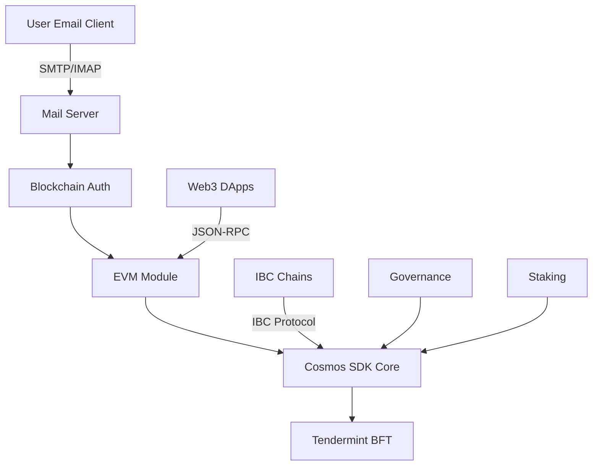

# MailChat Chain

**MailChat Chain** is an innovative blockchain-based email system that combines decentralized mail services with EVM-compatible smart contracts. Built on Cosmos SDK v0.53.4, it integrates email server functionality with blockchain technology to create a secure, decentralized communication platform.

[](LICENSE)
[](https://golang.org)
[](https://github.com/cosmos/cosmos-sdk)

🇺🇸 English | [🇨🇳 中文](README_ZH.md)

## 🌟 Features

### Core Capabilities
- **🔗 EVM Compatible**: Full Ethereum Virtual Machine support with Solidity smart contracts
- **📧 Decentralized Email**: Blockchain-authenticated email system with SMTP/IMAP support
- **🌐 Multi-DNS Support**: Automated TLS certificates with 15+ DNS provider integrations
- **⛓️ IBC Integration**: Cross-chain communication with Cosmos ecosystem
- **🏛️ Governance**: On-chain governance for network parameter management
- **💰 Staking & Rewards**: Validator network with delegation and reward distribution

### Technical Specifications

| Feature | Specification |
|---------|---------------|
| **Consensus** | Tendermint BFT |
| **Block Time** | 1-5 seconds (configurable) |
| **Chain ID** | `mailchatd_26000` |
| **EVM Chain ID** | `26000` |
| **Native Token** | MCC (Mail Chat Coin) |
| **Base Denom** | `amcc` (1 MCC = 10^18 amcc) |
| **TPS** | ~1000 (hardware dependent) |
| **Finality** | Instant (single block confirmation) |

## 🚀 Quick Start

### One-Click Installation

Install and configure MailChat Chain with a single command:

```bash
# Download and run the installation script
curl -sSL https://raw.githubusercontent.com/mail-chat-chain/mailchatd/main/start.sh | bash
```

The automated installer will:

1. **Download & Install** the `mailchatd` binary
2. **Domain Configuration** - Set up your email domain
3. **DNS Provider Setup** - Choose from 15 supported providers
4. **TLS Certificate** - Automatic ACME DNS-01 challenge setup
5. **Service Management** - Create and start systemd services
6. **Blockchain Integration** - Configure mail-to-blockchain transaction logging

### Supported DNS Providers

| Provider | Type | Authentication |
|----------|------|----------------|
| **Cloudflare** ⭐ | Global CDN | API Token |
| Amazon Route53 | AWS DNS | Access Key + Secret |
| DigitalOcean | Cloud DNS | API Token |
| Google Cloud DNS | GCP DNS | Service Account JSON |
| Vultr | Cloud DNS | API Key |
| Linode | Cloud DNS | API Token |
| Azure DNS | Microsoft DNS | Client Credentials |
| OVH | European DNS | API Keys |
| Hetzner | European DNS | API Token |
| Gandi | Domain Registrar | API Token |
| Namecheap | Domain Registrar | API Credentials |
| Porkbun | Domain Registrar | API Keys |
| DuckDNS | Dynamic DNS | Token |
| Hurricane Electric | Free DNS | Username/Password |
| **+ 1 more** | Various | Various |

## 🛠️ Manual Installation

### Prerequisites

```yaml
System Requirements:
  OS: Ubuntu 20.04+ / macOS 12+ / CentOS 8+
  CPU: 4+ cores (8+ recommended)
  RAM: 8GB minimum (32GB recommended)
  Storage: 200GB SSD (1TB NVMe recommended)
  Network: 100Mbps (1Gbps recommended)

Software Dependencies:
  Go: 1.23.8+
  Git: Latest
  Make: Latest
  jq: Latest
  curl: Latest
```

### Build from Source

```bash
# Clone the repository
git clone https://github.com/mail-chat-chain/mailchatd.git
cd mailchatd

# Build the binary
make build

# Verify installation
./mailchatd version
# Output: 0.1.0
```

### Initialize Local Node

```bash
# Set environment variables
export CHAINID="mailchatd_26000"
export MONIKER="my-mailchat-node"
export CHAINDIR="$HOME/.mailchatd"

# Initialize node
./mailchatd init $MONIKER --chain-id $CHAINID --home $CHAINDIR

# Create validator and user accounts
./mailchatd keys add validator --keyring-backend test --algo eth_secp256k1
./mailchatd keys add user1 --keyring-backend test --algo eth_secp256k1
```

### Start the Node

```bash
# Start the node
./mailchatd start --home $CHAINDIR

# Or use the start.sh script for automated configuration and startup
./start.sh
```

## 🔌 Network Configuration

### MetaMask Setup

1. Open MetaMask and click the network dropdown
2. Select "Add Network" → "Add a network manually"
3. Enter the following configuration:

```json
{
  "Network Name": "MailChat Local",
  "New RPC URL": "http://localhost:8545",
  "Chain ID": "26000",
  "Currency Symbol": "MCC",
  "Block Explorer URL": "http://localhost:8080" 
}
```

### Network Environments

| Environment | Network | RPC Endpoint | Chain ID | Explorer |
|-------------|---------|--------------|----------|----------|
| **Local** | Development | http://localhost:8545 | 26000 | http://localhost:8080 |
| **Testnet** | Testing | https://testnet-rpc.mailcoin.org | 262144 | https://testnet-explorer.mailcoin.org |
| **Mainnet** | Production | https://rpc.mailcoin.org | 262144 | https://explorer.mailcoin.org |

### Test Account (Local Only)

```
Mnemonic: gesture inject test cycle original hollow east ridge hen combine junk child bacon zero hope comfort vacuum milk pitch cage oppose unhappy lunar seat

Private Key: 0xac0974bec39a17e36ba4a6b4d238ff944bacb478cbed5efcae784d7bf4f2ff80
Address: 0xf39Fd6e51aad88F6F4ce6aB8827279cffFb92266
```

## 📧 Email Server Integration

### Mail Server Features

- **SMTP/IMAP Services**: Full-featured email server with encrypted communication
- **Blockchain Authentication**: Email access controlled by EVM wallet signatures
- **Transaction Logging**: All email operations recorded on-chain for audit trails
- **Distributed Storage**: IMAP mailboxes stored in SQLite with blockchain indexing
- **Spam Protection**: DKIM, SPF, DMARC validation with reputation scoring

### Configuration Example

```yaml
# mailchatd.conf
blockchain:
  chain_id: 80002
  rpc_url: http://127.0.0.1:8545

authentication:
  type: evm_wallet
  storage: local_mailboxes

tls:
  acme_provider: cloudflare
  dns_challenge: dns-01
  auto_renewal: true

services:
  smtp: "0.0.0.0:8825"
  imap: "0.0.0.0:993"
  submission: "0.0.0.0:587"
```

### DNS Management Commands

```bash
# Configure DNS settings
mailchatd dns config

# Check DNS configuration
mailchatd dns check

# Export DNS records for domain setup
mailchatd dns export

# Get public IP for A records
mailchatd dns ip
```

## 🏗️ Architecture

### System Components



### Available Modules

**Cosmos SDK Modules:**
- `auth` - Account authentication and management
- `authz` - Authorization for account actions
- `bank` - Token transfers and balances
- `distribution` - Staking reward distribution
- `evidence` - Byzantine behavior evidence handling
- `feegrant` - Fee payment delegation
- `gov` - On-chain governance proposals
- `mint` - Token inflation and minting
- `slashing` - Validator punishment for misconduct
- `staking` - Proof-of-Stake consensus participation
- `upgrade` - Coordinated network upgrades

**EVM Integration:**
- `evm` - Ethereum Virtual Machine execution
- `erc20` - ERC20 token standard support
- `feemarket` - EIP-1559 dynamic fee mechanism

**Custom Modules:**
- `mail` - Email server blockchain integration
- `dns` - DNS provider management
- `precisebank` - High-precision token operations

### Precompiled Contracts

Smart contracts can interact with Cosmos modules via precompiled addresses:

```solidity
// Staking operations
IStaking staking = IStaking(0x0000000000000000000000000000000000000800);

// Token distribution
IDistribution dist = IDistribution(0x0000000000000000000000000000000000000801);

// Cross-chain transfers
IICS20 ibc = IICS20(0x0000000000000000000000000000000000000802);

// Governance voting
IGovernance gov = IGovernance(0x0000000000000000000000000000000000000803);
```

## 🔧 Configuration

### Performance Tuning

```toml
# config.toml - Consensus settings
[consensus]
timeout_propose = "1s"
timeout_prevote = "1s" 
timeout_precommit = "1s"
timeout_commit = "3s"

# app.toml - EVM settings
[evm]
evm-chain-id = 26000
max-tx-gas-wanted = 0
tracer = ""

[json-rpc]
enable = true
address = "0.0.0.0:8545"
api = "eth,net,web3,debug,txpool"
```

### Economic Parameters

```json
{
  "inflation_rate": "13%",
  "inflation_max": "20%", 
  "inflation_min": "7%",
  "community_tax": "2%",
  "unbonding_time": "21 days",
  "max_validators": 100
}
```

## 📚 Documentation

- **[Complete Technical Documentation](DOCUMENTATION.md)** - Comprehensive setup and configuration guide
- **[API Reference](docs/api.md)** - JSON-RPC and gRPC endpoint documentation
- **[Smart Contract Guide](docs/contracts.md)** - EVM development and deployment
- **[Validator Guide](docs/validators.md)** - Running and maintaining validator nodes
- **[Governance Guide](docs/governance.md)** - Participating in chain governance

## 🤝 Contributing

We welcome contributions! Please see our [Contributing Guidelines](CONTRIBUTING.md) for details.

### Development Setup

```bash
# Install development dependencies
make install-dev

# Run tests
make test

# Run linter
make lint

# Build documentation
make docs
```

## 📄 License

This project is licensed under the Apache 2.0 License - see the [LICENSE](LICENSE) file for details.

## 🔗 Links

- **Website**: https://mailcoin.org
- **Documentation**: https://docs.mailcoin.org
- **Explorer**: https://explorer.mailcoin.org
- **Discord**: https://discord.gg/mailchat
- **Twitter**: https://twitter.com/mailchat_io

## 💡 Support

- **GitHub Issues**: For bugs and feature requests
- **Discord**: For community support and discussions
- **Documentation**: For setup and configuration help

---

**MailChat Chain** - Where Email Meets Blockchain 📧⛓️