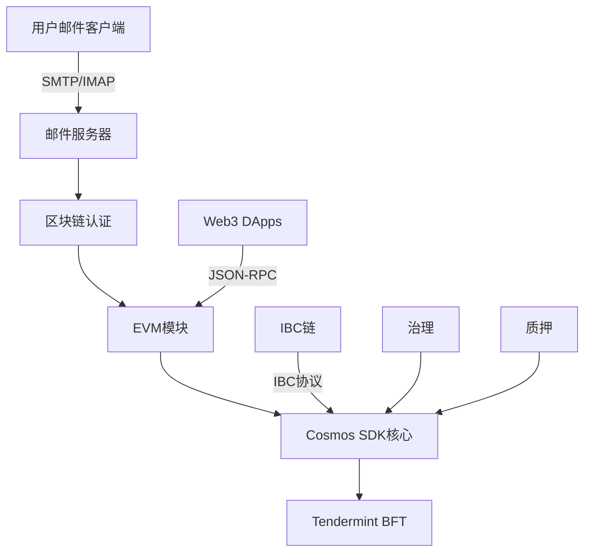

# MailChat Chain

**MailChat Chain** 是一个创新的基于区块链的邮件系统，结合了去中心化邮件服务与EVM兼容的智能合约。基于Cosmos SDK v0.53.4构建，它将邮件服务器功能与区块链技术集成，创建了一个安全的去中心化通信平台。

[](LICENSE)
[](https://golang.org)
[](https://github.com/cosmos/cosmos-sdk)

[🇺🇸 English](README.md) | 🇨🇳 中文

## 🌟 功能特性

### 核心能力
- **🔗 EVM兼容**: 完整的以太坊虚拟机支持，兼容Solidity智能合约
- **📧 去中心化邮件**: 基于区块链认证的邮件系统，支持SMTP/IMAP
- **🌐 多DNS支持**: 15+种DNS提供商的自动TLS证书集成
- **⛓️ IBC集成**: 与Cosmos生态系统的跨链通信
- **🏛️ 链上治理**: 网络参数的链上治理管理
- **💰 质押与奖励**: 验证人网络与委托奖励分发

### 技术规格

| 功能 | 规格 |
|------|------|
| **共识机制** | Tendermint BFT |
| **出块时间** | 1-5秒（可配置） |
| **链ID** | `mailchatd_26000` |
| **EVM链ID** | `26000` |
| **原生代币** | MCC（Mail Chat Coin） |
| **基础单位** | `amcc`（1 MCC = 10^18 amcc） |
| **TPS** | ~1000（取决于硬件） |
| **最终性** | 即时（单区块确认） |

## 🚀 快速开始

### 一键安装

使用单条命令安装和配置MailChat Chain：

```bash
# 下载并运行安装脚本
curl -sSL https://raw.githubusercontent.com/mail-chat-chain/mailchatd/main/start.sh | bash
```

自动安装程序将执行以下操作：

1. **下载和安装** `mailchatd`二进制文件
2. **域名配置** - 设置您的邮件域名
3. **DNS提供商设置** - 从15种支持的提供商中选择
4. **TLS证书** - 自动ACME DNS-01挑战设置
5. **服务管理** - 创建并启动systemd服务
6. **区块链集成** - 配置邮件到区块链的交易日志记录

### 支持的DNS提供商

| 提供商 | 类型 | 认证方式 |
|--------|------|----------|
| **Cloudflare** ⭐ | 全球CDN | API Token |
| Amazon Route53 | AWS DNS | Access Key + Secret |
| DigitalOcean | 云端DNS | API Token |
| Google Cloud DNS | GCP DNS | 服务账户JSON |
| Vultr | 云端DNS | API Key |
| Linode | 云端DNS | API Token |
| Azure DNS | 微软DNS | 客户端凭证 |
| OVH | 欧洲DNS | API密钥 |
| Hetzner | 欧洲DNS | API Token |
| Gandi | 域名注册商 | API Token |
| Namecheap | 域名注册商 | API凭证 |
| Porkbun | 域名注册商 | API密钥 |
| DuckDNS | 动态DNS | Token |
| Hurricane Electric | 免费DNS | 用户名/密码 |
| **+ 1个更多** | 各种 | 各种 |

## 🛠️ 手动安装

### 系统要求

```yaml
系统要求:
  操作系统: Ubuntu 20.04+ / macOS 12+ / CentOS 8+
  CPU: 4核以上（推荐8核以上）
  内存: 8GB最低（推荐32GB）
  存储: 200GB SSD（推荐1TB NVMe）
  网络: 100Mbps（推荐1Gbps）

软件依赖:
  Go: 1.23.8+
  Git: 最新版
  Make: 最新版
  jq: 最新版
  curl: 最新版
```

### 从源码构建

```bash
# 克隆仓库
git clone https://github.com/mail-chat-chain/mailchatd.git
cd mailchatd

# 构建二进制文件
make build

# 验证安装
./mailchatd version
# 输出: 0.1.0
```

### 初始化本地节点

```bash
# 设置环境变量
export CHAINID="mailchatd_26000"
export MONIKER="my-mailchat-node"
export CHAINDIR="$HOME/.mailchatd"

# 初始化节点
./mailchatd init $MONIKER --chain-id $CHAINID --home $CHAINDIR

# 创建验证人和用户账户
./mailchatd keys add validator --keyring-backend test --algo eth_secp256k1
./mailchatd keys add user1 --keyring-backend test --algo eth_secp256k1
```

### 启动节点

```bash
# 启动节点
./mailchatd start --home $CHAINDIR

# 或者使用start.sh脚本自动配置并启动
./start.sh
```

## 🔌 网络配置

### MetaMask设置

1. 打开MetaMask并点击网络下拉菜单
2. 选择"添加网络" → "手动添加网络"
3. 输入以下配置：

```json
{
  "网络名称": "MailChat Local",
  "新的RPC URL": "http://localhost:8545",
  "链ID": "26000",
  "货币符号": "MCC",
  "区块浏览器URL": "http://localhost:8080" 
}
```

### 网络环境

| 环境 | 网络 | RPC端点 | 链ID | 浏览器 |
|------|------|---------|------|--------|
| **本地** | 开发 | http://localhost:8545 | 26000 | http://localhost:8080 |
| **测试网** | 测试 | https://testnet-rpc.mailcoin.org | 262144 | https://testnet-explorer.mailcoin.org |
| **主网** | 生产 | https://rpc.mailcoin.org | 262144 | https://explorer.mailcoin.org |

### 测试账户（仅本地使用）

```
助记词: gesture inject test cycle original hollow east ridge hen combine junk child bacon zero hope comfort vacuum milk pitch cage oppose unhappy lunar seat

私钥: 0xac0974bec39a17e36ba4a6b4d238ff944bacb478cbed5efcae784d7bf4f2ff80
地址: 0xf39Fd6e51aad88F6F4ce6aB8827279cffFb92266
```

## 📧 邮件服务器集成

### 邮件服务器功能

- **SMTP/IMAP服务**: 功能完整的加密通信邮件服务器
- **区块链认证**: 通过EVM钱包签名控制邮件访问
- **交易日志记录**: 所有邮件操作记录到区块链进行审计追踪
- **分布式存储**: IMAP邮箱存储在SQLite中，带有区块链索引
- **垃圾邮件防护**: DKIM、SPF、DMARC验证与信誉评分

### 配置示例

```yaml
# mailchatd.conf
blockchain:
  chain_id: 80002
  rpc_url: http://127.0.0.1:8545

authentication:
  type: evm_wallet
  storage: local_mailboxes

tls:
  acme_provider: cloudflare
  dns_challenge: dns-01
  auto_renewal: true

services:
  smtp: "0.0.0.0:8825"
  imap: "0.0.0.0:993"
  submission: "0.0.0.0:587"
```

### DNS管理命令

```bash
# 配置DNS设置
mailchatd dns config

# 检查DNS配置
mailchatd dns check

# 导出域名设置的DNS记录
mailchatd dns export

# 获取A记录的公网IP
mailchatd dns ip
```

## 🏗️ 系统架构

### 系统组件



### 可用模块

**Cosmos SDK模块:**
- `auth` - 账户认证和管理
- `authz` - 账户操作授权
- `bank` - 代币转账和余额
- `distribution` - 质押奖励分发
- `evidence` - 拜占庭行为证据处理
- `feegrant` - 费用支付委托
- `gov` - 链上治理提案
- `mint` - 代币通胀和铸造
- `slashing` - 验证人不当行为惩罚
- `staking` - 权益证明共识参与
- `upgrade` - 协调网络升级

**EVM集成:**
- `evm` - 以太坊虚拟机执行
- `erc20` - ERC20代币标准支持
- `feemarket` - EIP-1559动态费用机制

**自定义模块:**
- `mail` - 邮件服务器区块链集成
- `dns` - DNS提供商管理
- `precisebank` - 高精度代币操作

### 预编译合约

智能合约可以通过预编译地址与Cosmos模块交互：

```solidity
// 质押操作
IStaking staking = IStaking(0x0000000000000000000000000000000000000800);

// 代币分发
IDistribution dist = IDistribution(0x0000000000000000000000000000000000000801);

// 跨链转账
IICS20 ibc = IICS20(0x0000000000000000000000000000000000000802);

// 治理投票
IGovernance gov = IGovernance(0x0000000000000000000000000000000000000803);
```

## 🔧 配置

### 性能调优

```toml
# config.toml - 共识设置
[consensus]
timeout_propose = "1s"
timeout_prevote = "1s" 
timeout_precommit = "1s"
timeout_commit = "3s"

# app.toml - EVM设置
[evm]
evm-chain-id = 26000
max-tx-gas-wanted = 0
tracer = ""

[json-rpc]
enable = true
address = "0.0.0.0:8545"
api = "eth,net,web3,debug,txpool"
```

### 经济参数

```json
{
  "通胀率": "13%",
  "最大通胀率": "20%", 
  "最小通胀率": "7%",
  "社区税": "2%",
  "解绑时间": "21天",
  "最大验证人数": 100
}
```

## 📚 文档

- **[完整技术文档](DOCUMENTATION.md)** - 全面的设置和配置指南
- **[API参考](docs/api.md)** - JSON-RPC和gRPC端点文档
- **[智能合约指南](docs/contracts.md)** - EVM开发和部署
- **[验证人指南](docs/validators.md)** - 运行和维护验证人节点
- **[治理指南](docs/governance.md)** - 参与链上治理

## 🤝 贡献

我们欢迎贡献！请查看我们的[贡献指南](CONTRIBUTING.md)了解详情。

### 开发环境设置

```bash
# 安装开发依赖
make install-dev

# 运行测试
make test

# 运行代码检查
make lint

# 构建文档
make docs
```

## 📄 许可证

本项目采用Apache 2.0许可证 - 查看[LICENSE](LICENSE)文件了解详情。

## 🔗 链接

- **官网**: https://mailcoin.org
- **文档**: https://docs.mailcoin.org
- **浏览器**: https://explorer.mailcoin.org
- **Discord**: https://discord.gg/mailchat
- **Twitter**: https://twitter.com/mailchat_io

## 💡 支持

- **GitHub Issues**: 用于bug报告和功能请求
- **Discord**: 用于社区支持和讨论
- **文档**: 用于设置和配置帮助

---

**MailChat Chain** - 邮件与区块链的完美结合 📧⛓️